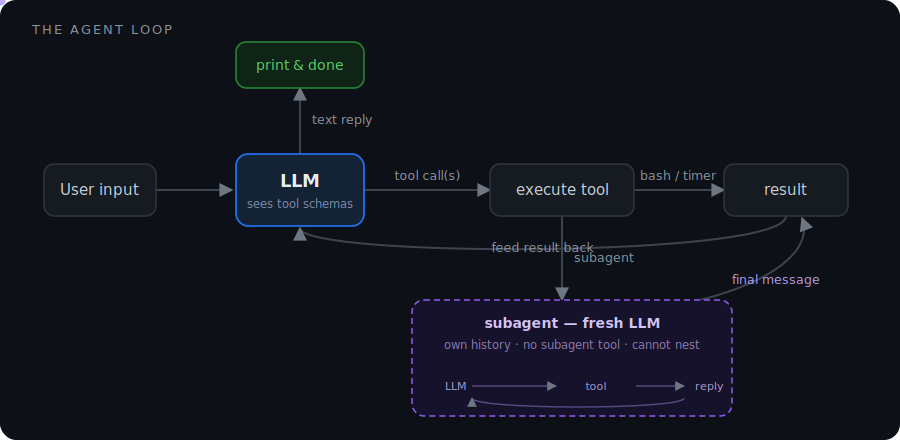

# claude-code-in-100-lines

### "Less is more"

> **Every agent framework hides the loop or makes it too complex. This one shows it to you — in ~110 lines of Python.**
<p align="center">
  
</p>


## What you'll learn

Read the source and you'll understand, concretely:

- **The agent loop** — how an LLM "uses tools": the input → model → tool-call → feed-result-back cycle that every framework wraps and hides (`llm.py`).
- **Tool dispatch** — how the model picks a tool and the harness runs it, with schemas auto-derived from plain Python docstrings, no JSON to maintain (`tools.py`).
- **Skills & progressive disclosure** — how to hand an agent deep, task-specific playbooks *without* paying for their tokens on every turn (`loader.py` + `prompts/skills/`).
- **Subagents** — how an agent spawns a fresh, isolated agent for a sub-task, and why bounding recursion matters.
- **Memory** — how an agent keeps a fact across sessions: a `.agent/` directory it writes to itself, surfaced to the model as just a path it reads on demand — same progressive-disclosure trick as skills, nothing loaded by default (`memory.py`).

If you've ever wanted to know what's *actually* happening inside Cursor, Claude Code, or an "autonomous agent," this is the whole thing with nothing hidden.

Useful link: https://walkinglabs.github.io/learn-harness-engineering/en/

## How it works
Most agent frameworks hide the loop. This one exposes it:

```text
User input
    │
    ▼
LLM (with tool schemas)
    │
    ├── text response → print & done
    │
    └── tool call(s)
            │
            ▼
       execute tool
            │
            ├── bash / timer ─────────────► result
            │
            └── subagent ──► fresh LLM (own history, no `subagent` tool)
                                │
                                ▼
                          runs this same loop
                                │
                                ▼
                          final message ──► result
                                │
                                ▼
                        feed result back → LLM (repeat)
```

The model sees tool schemas, decides when to call them, and the harness executes them and loops until the model returns a plain text response. One of those tools is `subagent`, which spins up a fresh `LLM` with its own message history and runs this exact loop again — a nested agent inside the agent.

## Structure

```text
src/
  main.py        # REPL loop + builds the system prompt
  llm.py         # LLM class — message history + the tool-call loop
  tools.py       # Tool implementations: bash, timer, subagent
  loader.py      # Loads prompts and builds the skills index
  memory.py      # Creates .agent/ and loads the MEMORY.md index into context
  prompts/
    agent/       # system_prompt.md, subagent_prompt.md
    skills/      # one folder per skill, each with a SKILL.md
```

## Tools

| Tool       | Description                                            |
|------------|-------------------------------------------------------|
| `bash`     | Run a shell command, return stdout + stderr           |
| `timer`    | Sleep for N seconds                                    |
| `subagent` | Delegate a self-contained task to a fresh-context agent |

Tool schemas are **not** hand-written. Ollama derives them from each function's signature and Google-style docstring, so adding a tool is just writing a function — there's no parallel JSON schema to keep in sync.

## Subagents

`subagent` lets the agent delegate a self-contained task to a brand-new `LLM` instance with its own empty message history. Use it to keep a noisy sub-task — a wide search, a long build, an exploratory dig — out of the main conversation, returning only the conclusion.

- **Fresh context.** The child sees only the task string you hand it, never the parent's history.
- **No recursion.** The child gets every tool *except* `subagent` itself (`tools.py` filters it out), so it can't spawn its own children and runaway.
- **One return value.** It runs the same tool-call loop to completion and hands back only its final message.
- **Same skills.** The subagent prompt is injected with the same skills index, so subagents follow skills just like the parent.

## Setup

### 1. Install Ollama

| Platform | Command |
|----------|---------|
| macOS / Linux | `curl -fsSL https://ollama.com/install.sh \| sh` |
| Windows | Download from [ollama.com/download](https://ollama.com/download) |

Then pull the default model (requires tool-use support):
```bash
ollama pull gemma4:31b-cloud
```

### 2. Install Python dependencies

**Option A — uv (recommended, identical on Windows / macOS / Linux)**

Install uv:

| Platform | Command |
|----------|---------|
| macOS / Linux | `curl -LsSf https://astral.sh/uv/install.sh \| sh` |
| Windows (PowerShell) | `irm https://astral.sh/uv/install.ps1 \| iex` |
| Windows (winget) | `winget install astral-sh.uv` |

Then:
```bash
uv sync
```

**Option B — pip**
```bash
pip install -r requirements.txt
```

## Run

**With uv**
```bash
uv run python -m src.main
```
or via the package entry point:
```bash
uv run harness
```

**With pip**
```bash
python -m src.main
```

```text
You> what files are in the current directory?
  ↳ bash({'command': 'ls'}) -> LICENSE  README.md  requirements.txt  src
LLM> The current directory contains: LICENSE, README.md, requirements.txt, and src/.
```

Every tool call is printed as it happens — `↳ name(args) -> result` — so you watch the loop turn instead of only seeing the final answer.

## Skills

Skills are on-demand playbooks in `src/prompts/skills/` — detailed instructions the model reads *only when a task needs them*, instead of carrying every skill's text in context on every turn (progressive disclosure). The layout follows the [Agent Skills](https://github.com/anthropics/skills) spec: one folder per skill, each with a `SKILL.md`.

At startup `loader.py` scans `src/prompts/skills/*/SKILL.md` and injects a one-line index — each skill's `description:` line plus an absolute `cat` path — into the system prompt. The model reads a skill in full with that `cat` command when a task matches; no extra tool needed, since it already has `bash`. A skill folder may include supporting files the `SKILL.md` references on demand. The subagent prompt gets the same index, so subagents use skills too.

| Skill                     | Source                                   |
|---------------------------|------------------------------------------|
| `frontend-design`         | [anthropics/skills](https://github.com/anthropics/skills) |
| `systematic-debugging`    | [obra/superpowers](https://github.com/obra/superpowers) (MIT) |
| `test-driven-development` | [obra/superpowers](https://github.com/obra/superpowers) (MIT) |
| `writing-plans`           | [obra/superpowers](https://github.com/obra/superpowers) (MIT) |
| `code-review`             | bundled                                  |
| `git-commit`              | bundled                                  |


## Memory

The agent has a long-term memory that outlives a single session. On startup `memory.py` creates a `.agent/` directory **in whatever directory you run the harness from**, so each project the agent touches keeps its own memory:

```text
.agent/
  MEMORY.md        # the index — one line per memory; read on demand, not injected
  memory/
    <slug>.md      # one fact per file, with frontmatter; read on demand
```

Memory works **exactly like skills**: nothing is loaded into context by default. The system prompt is injected only with the *path* to `MEMORY.md`, and the agent `cat`s the index when it judges a past memory might be relevant — then `cat`s the one memory file whose index line matches. So a hundred memories cost nothing per turn until they're actually needed.

The agent writes its own memories. The system prompt teaches it the format (a kebab-case `name`, a `description` used for recall, and a `type` — `user` / `feedback` / `project` / `reference`) and when to bother: durable things like a stable user preference or a non-obvious project constraint, never what the repo already records. It writes a memory by `cat`-ing a file into `.agent/memory/` and appending one index line to `.agent/MEMORY.md` — plain `bash`, no new tool. `.agent/` is gitignored, so the demo never dirties the repo.

> ⚠️ **Not affiliated with Anthropic.** This isn't Claude Code and it doesn't call any Anthropic API. It's a from-scratch reimplementation of *how agents like Claude Code work*, running on whatever model you point Ollama at. The name is a nod to the idea, not the product.
